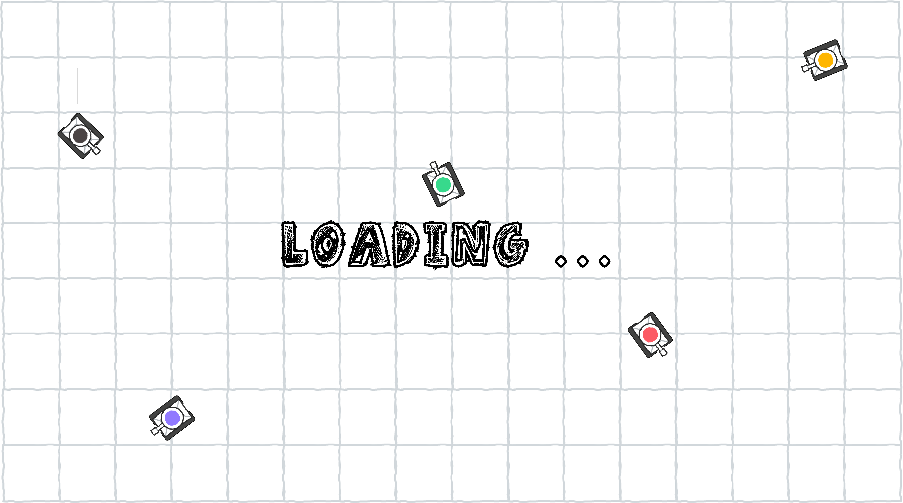
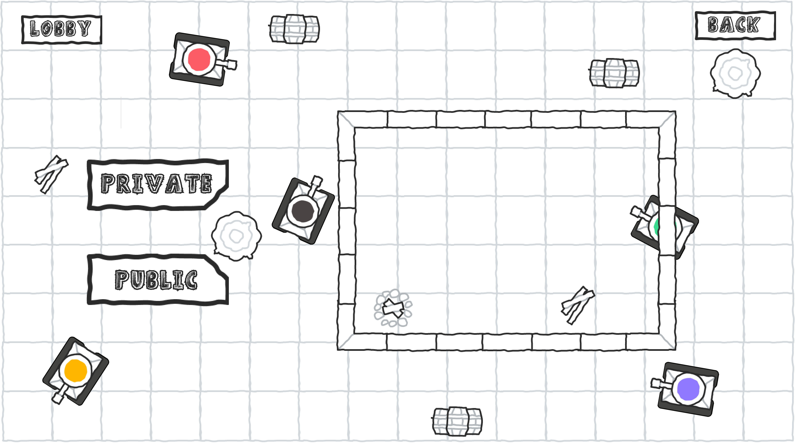
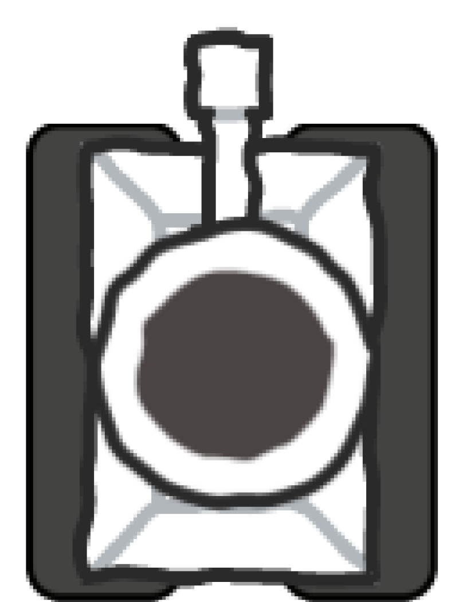
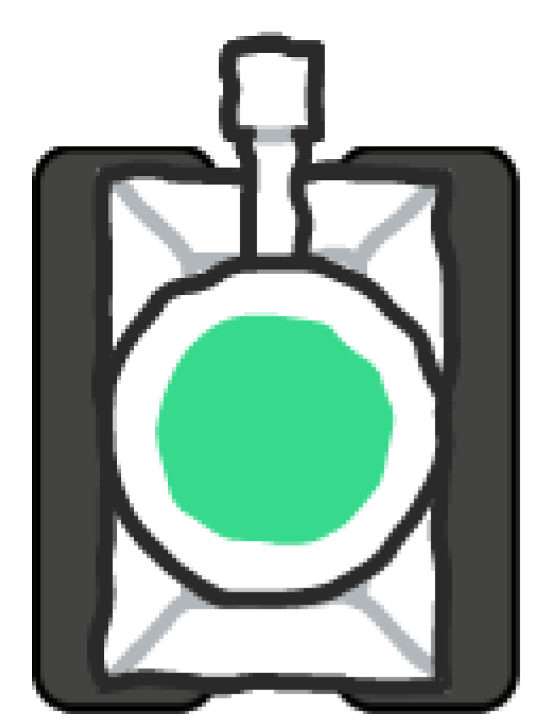
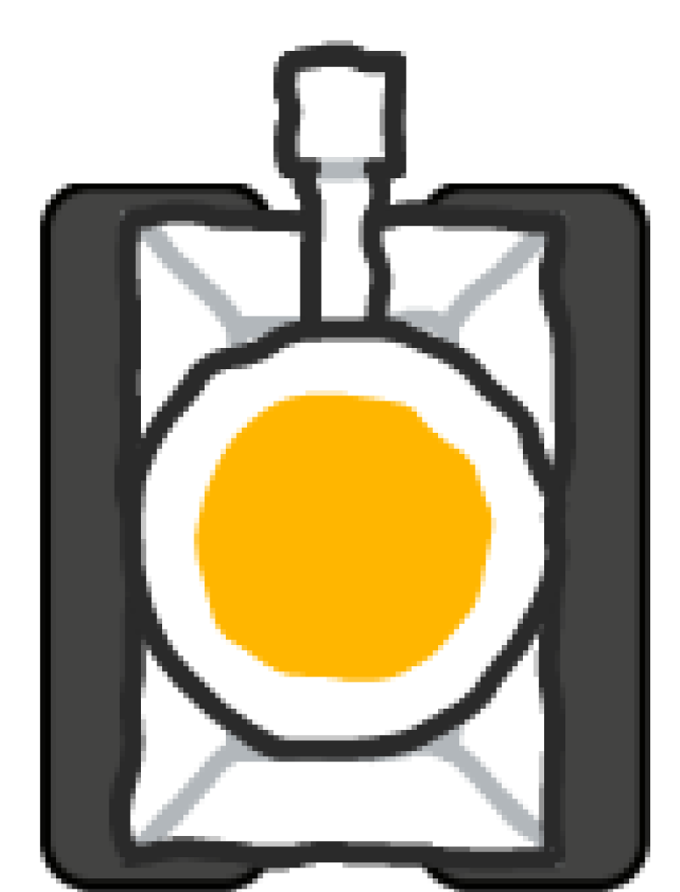
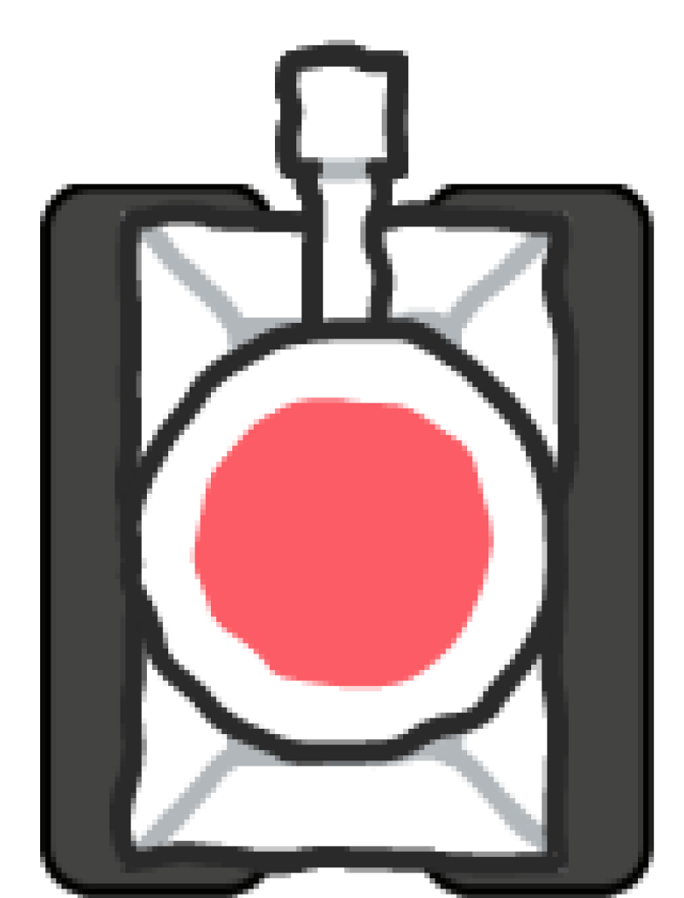
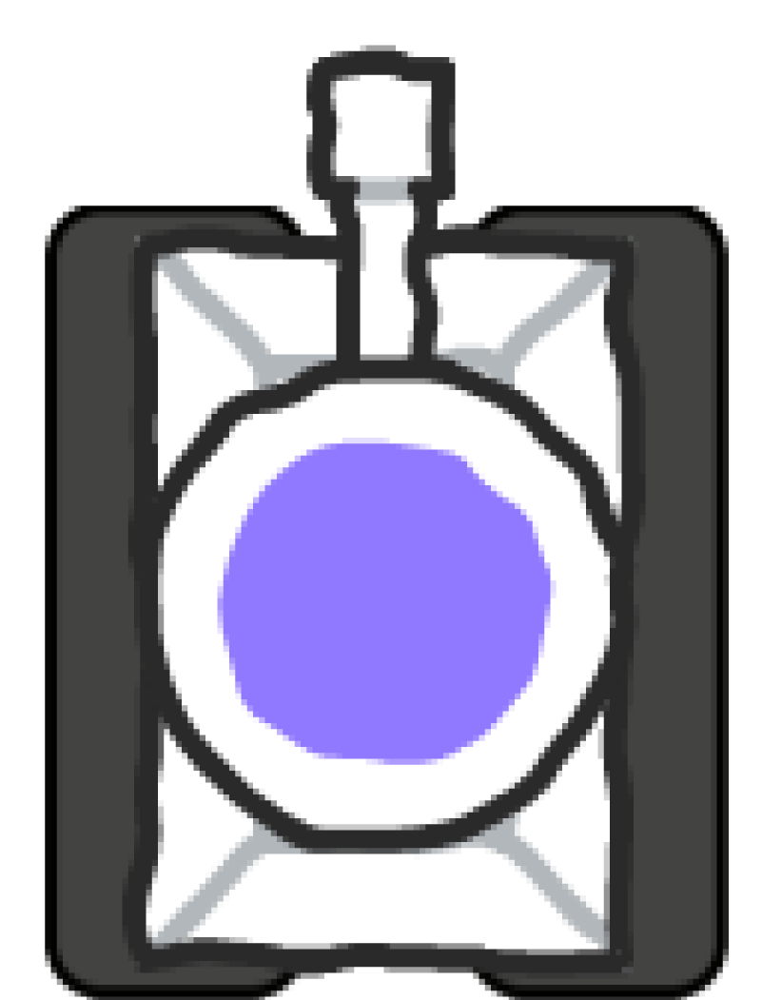

All builds of this game for backup

# Sketch_battle.io (UNDER DEVELOPMENT)

**Sketch_battle.io** is a thrilling 2D top-down multiplayer game built using the Unity Engine and Unity Netcode for GameObjects (NGO). Engage in intense tank battles with up to 5 players, each controlling a unique tank. Whether you play locally, cooperatively with friends, or compete against others online, Sketch_battle.io offers exciting gameplay with amazing obstacles and pickups that will keep you on the edge of your seat!

## Features

- **5 Player Gameplay**: Battle it out with up to 5 players, each with a distinct tank.
- **Unique Tanks**: Choose from 5 different tanks, each with its own strengths and abilities.
- **Multiple Modes**:
  - **Co-op Mode**: Team up and strategize with friends to take on challenges.
  - **Multiplayer Mode**: Compete against players from around the world.
- **Amazing Obstacles**: Navigate through a variety of challenging obstacles that add depth and strategy to the game.
- **Exciting Pickups**: Collect power-ups and other pickups to gain an edge over your opponents.

## Screenshots

## Tanks

  
  
  
  
  

## Acknowledgements

- Special thanks to the Unity community and contributors of Unity Netcode for GameObjects (NGO).

## Contact

If you have any questions, suggestions, or feedback, feel free to contact us at [dhruvpitwala@gmail.com](mailto:dhruvpitwala@gmail.com).

---

Enjoy the game and happy tank battling!

